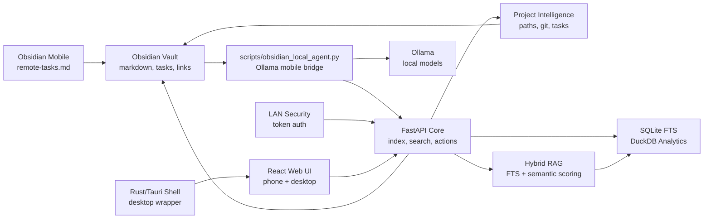

# ObsidianAI Architecture

ObsidianAI is a local-first control center for Lim's Obsidian vault and code projects.
It follows the vault protocol from `/Users/justalim/projects/obsidian-vault/CLAUDE.md`:
read the vault first, do not ask for already-known context, and save useful session knowledge.

## North Star

Build a private AI workspace that knows:

- what is inside the Obsidian vault;
- what projects exist under `~/projects`;
- what tasks, decisions, links, sessions, and active problems are already recorded;
- what actions the AI wants to perform;
- which actions are still waiting for Lim's approval.

The system must never silently mutate important files. Every AI write becomes a pending
action with a diff preview, backup path, and audit log entry.

## Runtime Shape



## Stack

| Layer | Technology | Reason |
| --- | --- | --- |
| Core API | Python + FastAPI | Fast iteration, excellent local automation, easy AI integrations |
| Safety engine | Python service layer | Centralized approval queue for all writes |
| UI | React + Vite | Fast web app usable from desktop and phone |
| Desktop shell | Rust + Tauri target | Long-term native shell, secure filesystem boundary, low resource usage |
| Operational DB | SQLite + FTS5 | Local, portable, fast enough for vault-scale search |
| Analytics DB | DuckDB | Local analytical queries and time-series snapshots |
| Local AI | Ollama | Private, offline-capable, no token cost |
| Mobile bridge | Obsidian synced markdown | Phone can trigger local Mac actions through iCloud sync |

## Recommended Local Model

Target model: `qwen3:latest`.

Reason: Qwen3 gives stronger local reasoning for vault/project work while still running through Ollama.
Optional larger model: `qwen3:14b`.

Install:

```bash
ollama pull qwen3
```

The app defaults to `qwen3:latest`. The previous fallback remains `llama3:latest` if needed.

## Safety Model

Every write follows this lifecycle:

1. AI proposes an action.
2. Backend creates `action_requests` row with payload and diff.
3. UI shows the pending action.
4. Lim approves or rejects.
5. Approved actions are applied.
6. Existing files are backed up.
7. `audit_log` records the result.

Supported first actions:

- `create_note`
- `update_note`
- `append_note`
- `delete_note`
- `rename_note`
- `write_file` under `/Users/justalim/projects`

Protected areas:

- vault `CLAUDE.md`
- vault `raw/`
- `.git`
- paths outside `/Users/justalim/projects`
- paths outside the selected Active Workspace for AI `write_file` actions

## Roadmap

### Phase 1: Control Center MVP

- Vault setup and indexing
- Full-text search
- Knowledge graph stats
- Local Ollama chat
- Pending action queue
- Mobile task bridge
- Web UI for desktop and phone

### Phase 2: Project Intelligence

- Project registry from `wiki/INDEX.md` ✅
- Per-project workspace cards in the web UI ✅
- Task extraction from project notes ✅
- Git status and branch summaries ✅
- Automatic session save into `outputs/sessions`

### Phase 3: Deep RAG

- Hybrid local semantic search ✅
- Embedding index for semantic search
- Context packs per project ✅
- Link recommendations
- Orphan note repair suggestions
- Daily and weekly AI briefs

### Phase 4: Native Desktop

- Tauri shell
- macOS launchd autostart for backend/frontend/mobile bridge ✅
- Menu bar agent controls
- Local notifications for pending approvals
- Secure command permissions
- Background indexing daemon

### Phase 5: Agent OS

- Multi-step project execution plans ✅
- Test runner integration
- Controlled local learning memory ✅
- Project health and safe verification command registry ✅
- PR/commit assistant
- Obsidian canvas generation
- Local memory and preferences
- Plugin system for new tools

## Agent OS Runtime

The Agent OS layer stores each substantial request as an `execution_session`.
The planner creates an `execution_plan` with ordered `execution_plan_steps`.
Each step keeps objective, expected result, target files, checks, risks and approval state.
Approved steps can request AI-generated pending actions through the normal action engine.
The step stores linked `action_ids`, while `action_requests` still own diffs, approvals,
backups and final writes.

Safe command execution is intentionally narrow. The backend only runs allowlisted
verification commands such as `npm run build`, `python -m unittest`, `cargo check`
or `flutter analyze`, and it stores output in `command_runs`.

## Controlled Learning Model

Learning memory lives in `learning_items` and is user-governed:

- `review` mode keeps new memories pending until Lim activates them.
- `active` memory is included in chat and planning context.
- archived memory is retained for audit but excluded from prompts.

This gives the assistant a way to become more useful over time without silently changing
its behavior behind the user's back.
